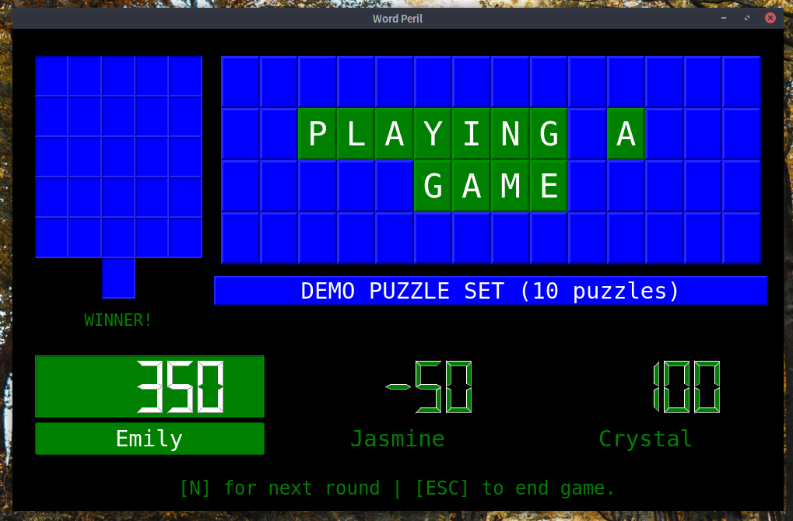
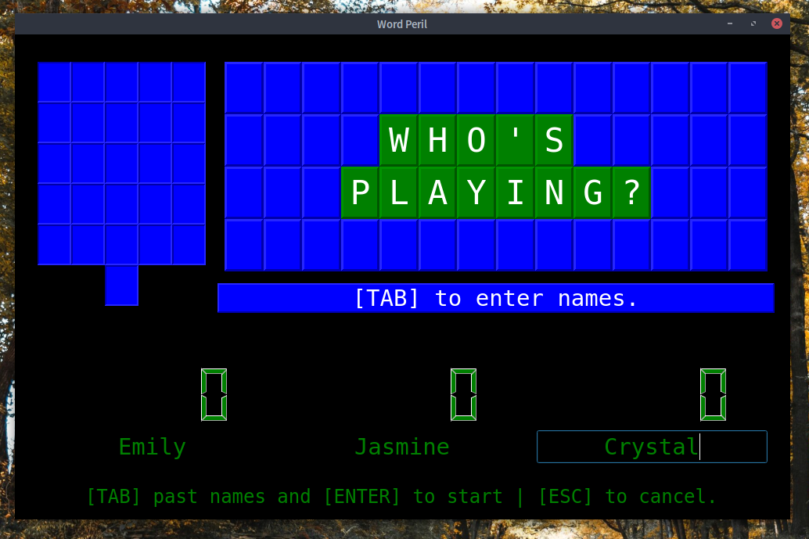
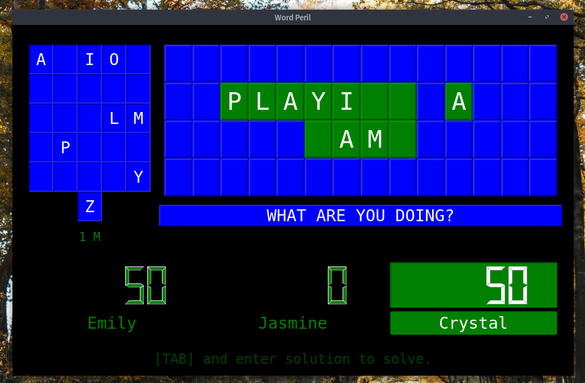
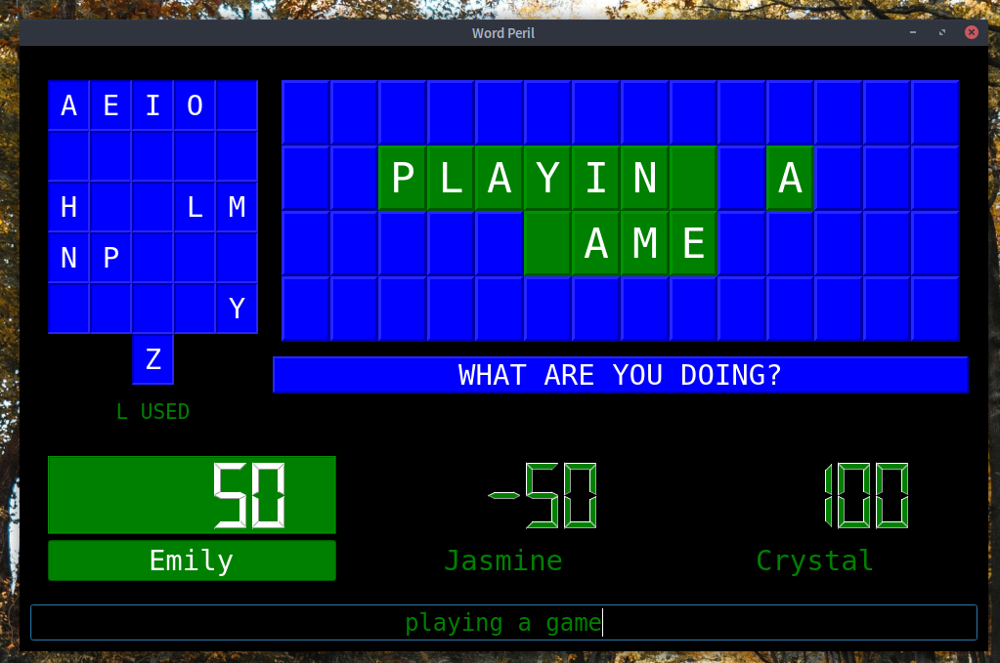

# Word Peril

A live-play word game for three players, similar to "Wheel of Fortune" and
"Hangman", with "Jeopardy"-inspired scoring. Great for parties,
special events, or family game night.

The game is displayed on a single screen, and the keyboard used to
control the game during live play. On screen prompts ensure you
always know what's happening.



## Adding Puzzles

We include a default set of puzzles with the game. However, you can add your
own puzzles in the form of `.peril` files, which are written in JSON format.

See `example_puzzleset.peril` in the root of this repository for an example
of a puzzleset file.

Each puzzleset must have a **title** as the key for the first object, and
one or more **clues**, each one associated with a **list** of **puzzles**.

Here's a shortened example, with a title of "Office Stuff", a single clue
"thing", and two separated puzzles that use that clue.

```
{
    "Office Stuff":
    {
        "thing": [
            "stack of sticky notes",
            "pink eraser"
        ]
    }
}
```

Word Peril converts all text to ALL CAPS, so letter case is not important.

Clues should be as vague as possible, using names such as "phrase", "thing",
"title", or "what are you doing?"

Every puzzle should be able to fit on the game board, which is four rows of
fourteen letters. A single word and its connected punctuation will never be
broken across multiple rows. The game will figure out how to best fit the
puzzle to the board; if it can't, Word Peril will simply omit the puzzle from
the puzzle set.

## Game Rules

2-3 players, plus a Host to control the game.

A game consists of as many puzzles can be fit into a set period of time
(10 minutes recommended). Do not start a new puzzle when you only have 1:30
left in the round.

Before the game starts, the Host should remind everyone of the rules.

At the start of the round, the Host should read the clue aloud. The leftmost
player starts the first round.

During their turn, a player may do one of two things:

1. Guess a letter. If the letter is in the puzzle *and* not used, the player
   gains points (for consonants only) and can make another guess. If the
   letter is *not* in the puzzle, they lose 50 points and their turn ends.
   If the letter is already guessed, their score is unaffected, and their turn
   ends.
2. Request to solve the puzzle. When told by the Host to go ahead, they should
   read the entire puzzle out loud, adding and omitting nothing. If they are
   correct, they gain 300 points and the round is over. If they are incorrect,
   they lose 200 points and their turn end.

The player with the highest positive score at the end of *all* rounds wins
the game. You cannot win with a negative score.

## Gameplay

Word Peril is controlled entirely by the keyboard. You should pick one person
to control the game, preferably a designated "host" instead of a player.

### Game Setup

When you first launch Word Peril, you will need to load a **puzzle set**
from a `.peril` file. (See "Where Are The Puzzles?") Press `L` to load a
puzzleset, and then navigate to a `.peril` file.

Word Peril will immediately process the file. If it encounters any fatal error,
it will warn you with an "Invalid File" message on the screen, and will *not*
finish loading the file. If you had a prior puzzle set loaded, that set will
remain loaded.

Once a puzzle set has been successfully loaded, the title of the set will be
displayed, along with the number of available puzzles. This number is the
total number of puzzles in the puzzle set, minus (a) any puzzles that won't fit
on the puzzle board, and (b) any puzzles that have already been played (see
"Cache" below.)

Once you're ready to play, press the `ENTER` or `RETURN` key.

#### Cache

Word Peril remembers what puzzles have already been played in a given set,
and stores this data in a cache file on your computer. This way, you can
be certain that you won't have any repeat puzzles when playing multiple rounds,
even if you restart the program.

You can reset the cache for the current puzzle set by pressing the `R` key.
You'll see a "Reset Puzzle Set!" message on your screen if this is successful,
and the puzzle count will reset.

### Players Setup

The next step is to tell Word Peril who's playing. Press the `TAB` key to move
into each name field on the scoreboard, and type the name of each player.
You *must* fill in all player fields before you can start a round.

NOTE: I'll be adding two-player support later.

Once you have all names filled in, and then make sure you've tabbed *past* all
the names (none will be selected) and press `ENTER` or `RETURN` to start the
game. You'll next see the Score Screen, which is displayed between rounds.



### Score Screen

When you first start the game, and after each round, you'll see the Score
Screen. This will show:

* The name of the current puzzle set, and how many puzzles remain.
* The current scores of the players. The highest positive score is highlighted.
* The last solved puzzle.

Press `N` to start the next round, or `ESC` to quit. **As soon as you quit,
all the scores will be erased and unrecoverable!**

### Puzzle Screen

There are six main elements to the puzzle screen:

* The **Used Letter Board** is on the left. Vowels are shown on the top row,
  and the consonants are displayed alphabetically on the remaining rows.
* The **Puzzle Board** is the large board on the right. Empty green tiles are
  letters that need to be filled in, and blue tiles are unused.
* The **Clue** is displayed on the bar below the Puzzle Board.
* The **Scoreboard** is below the puzzle area, showing the players and their
  scores. The current player is highlighted in green.
* The **Solve Bar** is below the Scoreboard. `TAB` into this field and enter
  the puzzle to solve it.

#### Guessing Letters

To guess a letter, press a letter key.

* A **correct consonant** adds 50 points per instance in puzzle.
* A **correct vowel** adds no points.
* An **incorrect letter** removes 50 points and ends the turn.
* An **already used letter** adds/removes no points, but ends the turn.

Whenever a letter is guessed, it is added to the Used Letter Board.



#### Solving the Puzzle

To solve the puzzle, `TAB` to the Solve Bar at the bottom of the screen, and
enter the puzzle. Only the letters are checked: spaces and symbols are ignored.

Even if the board is completely filled, the player must still solve the puzzle.

* A **correct solve** adds 300 points and ends the game.
* An **incorrect solve** removes 200 points and ends the turn.



#### Undo

If the host makes a mistake, such as entering the wrong letter or introducing
a typo into the solved puzzle, the *most recent action* can be undone by
pressing the `PAUSE` key.

This feature is not intended as a part of gameplay.
**Players are never allowed to "take back" a move.** The Undo feature is *only*
for fixing mistakes where their keyboard entry does not match the player's
stated letter guess or puzzle solve attempt.

### Between Rounds

At the end of the round, you return to the Score Screen. The completed puzzle
is displayed, along with the current scores for the whole game so far. The
highest positive score is highlighted; if there's a tie, both/all the players
with identical high scores are highlighted.

A new round can be started with `N`. The current scores are carried into the
next round.


### End of Game

When there's no time left for a new round, congratulate the winner of the game,
et cetera.

Pressing `ESC` ends the game **and immediately erases scores!** Do not press
this key until you're ready to permanently erase the scores.

Once the game is ended, you'll return to the Player Setup screen to enter new
names, or if the puzzle set is "exhausted" (no unused puzzles left), to the Game
Setup screen to load or reset a puzzle set.

## Tech Stack

* Python 3.8
* PySide2
* appdirs

## Installing

To install from source, see BUILDING.md.

## Contributions

We do NOT accept pull requests through GitHub.
If you would like to contribute code, please read our
[Contribution Guide][3].

All contributions are licensed to us under the
[MousePaw Media Terms of Development][4].

## License

Word Peril is licensed under the BSD-3 License. (See LICENSE.md)

The project is owned and maintained by [MousePaw Games][1],
a subsidiary of [MousePaw Media][2].

[1]: https://www.mousepawgames.com/wordperil
[2]: https://www.mousepawmedia.com/developers
[3]: https://www.mousepawmedia.com/developers/contribution
[4]: https://www.mousepawmedia.com/termsofdevelopment
[5]: https://github.com/mousepawmedia/wordperil
